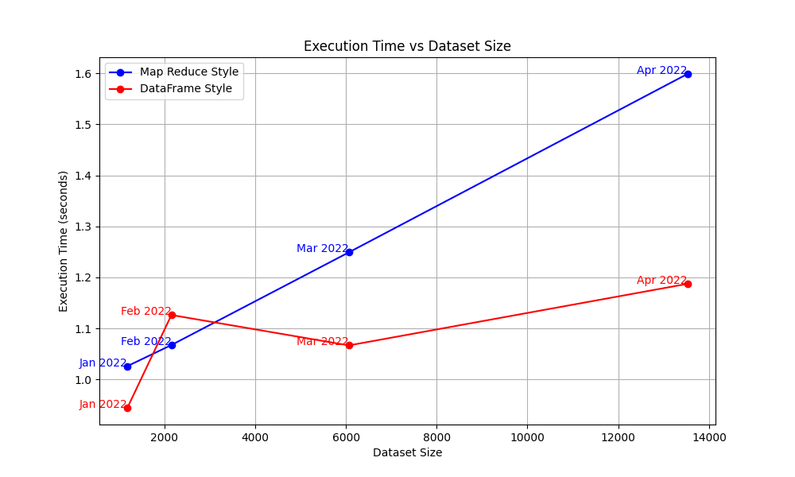

# Mining the White House visitor Log dataset using PySpark

## Background

This is Assignment 1 for the Big Data Systems & Analytics course (CS-6220) at Georgia Tech. I chose to complete Option 2.2, which provides hands-on experience in solving a real-world data systems problem.

## Dataset

The dataset I'm working with is named 2022.01_WAVES-ACCESS-RECORDS, a version of the White House Visitor Access Records, often referred to as the WAVES (Worker and Visitor Entry System) dataset. This dataset contains detailed information about individuals visiting the White House, including information on who visited, who they met with, the location of the meeting, and other relevant details.

Most recent updated dataset can be found on the official website of whitehouse: https://www.whitehouse.gov/disclosures/visitor-logs/. I used the datasets from Jan 2022 to April 2022 for this assignment.

## Packages and Tools

For this assignment, I used PySpark. Specifically, I leveraged two different libraries within Spark. First, I implemented the MapReduce approach to address the problem (see map_reduce_style.py). This involved writing RDD-based code that mimics the traditional Hadoop MapReduce steps. Additionally, I explored Spark's cleaner and more optimized method for working with structured datasets by adapting the DataFrame API as a second approach to validate my results (see dataframe_style.py). This method utilizes APIs from pyspark.sql, allowing users to query data similarly to SQL, with Hadoop MapReduce as the underlying foundation.

## Acknowledgement

This code is developed based on the inspiration from and enhancements to some great open-source examples. Specifically, the MapReduce approach draws from examples provided in this repository: https://github.com/knelleralex/MapReduce_example/tree/master. The DataFrame approach is informed by examples from this repository: https://github.com/krishnaik06/Pyspark-With-Python/tree/main. Additionally, I frequently consulted Stack Overflow for various coding solutions (https://stackoverflow.com).

## Experiments

For this assignment, I used the datasets from January 2022 to April 2022. The January 2022 dataset contains 1,186 entries, February 2022 has 2,156 entries (1.82x of January 2022), March 2022 has 6,066 entries (5.11x of January 2022), and April 2022 has 13,525 entries (11.4x of January 2022).

The two scripts perform the same tasks but using different approaches. Specifically, they calculate:

1. The 10 most frequent visitors (NAMELAST, NAMEFIRST, NAMEMID) to the White House.
2. The 10 most frequently visited people (visitee_namelast, visitee_namefirst) in the White House.
3. The 10 most frequent visitor-visitee combinations.
4. The 3 most frequent meeting locations.
5. The 10 most frequent callers.

I ran the `map_reduce_style.py` script on all four datasets and recorded the execution times for each. Additionally, I ran the `dataframe_style.py` script on these datasets for comparison.

## Results

### Jan 2022 - map_reduce_style

**Top 10 Most Frequent Visitors:**

- WILKINS, ELIZABETH W: 6 visits
- KUKLISH, MATILDA N: 5 visits
- GITENSTEIN, MARK H: 5 visits
- NASRI, HANAH Z: 5 visits
- SMITH, MICHAEL D: 5 visits
- GONZALUDO, ALEXIS C: 5 visits
- REED, CHRISTOPHER M: 5 visits
- MCQUADE, VIRGINIA S: 5 visits
- HALLII, TONY L: 5 visits
- EMANUEL, RAHM I: 4 visits

**Top 10 Most Frequent Visitees:**

- POTUS: 117 visits
- Dirksen, Ward: 43 visits
- Doyle, Solis: 41 visits
- Sullivan, Jake: 31 visits
- Schaffer, Audrey: 30 visits
- Snopek, Daniel: 28 visits
- Hart, Rio: 27 visits
- Neuberger, Anne: 26 visits
- Ludwig, Michael: 23 visits
- Nelson, David: 22 visits

**Top 10 Most Frequent Visitor-Visitee Combinations:**

- WILKINS, ELIZABETH W -> Puri, Arjun: 6 visits
- GONZALUDO, ALEXIS C -> Doyle, Solis: 5 visits
- MCQUADE, VIRGINIA S -> Doyle, Solis: 5 visits
- HALLII, TONY L -> Colton, Amelia: 5 visits
- SMITH, MICHAEL D -> Hart, Rio: 4 visits
- JAVIER, PEPITO M -> McGurk, Brett: 4 visits
- BRINGHAM, WESLEY P -> Forrester, Dwight: 4 visits
- MCFARLIN, ROBERT W -> Forrester, Dwight: 4 visits
- TODD, MICHAEL C -> Forrester, Dwight: 4 visits
- BROOKS, VINCENT A -> Snopek, Daniel: 4 visits

**Top 3 Meeting Locations:**

- OEOB: 693 meetings
- WH: 353 meetings
- NEOB: 93 meetings

**Top 10 Most Frequent Callers:**

- BUTLER, NICOLE: 61 calls
- DIRKSEN, WARD: 49 calls
- NADEEM, ALEA: 43 calls
- ORTIZ, ONISSA: 42 calls
- STEWART, REBECCA: 37 calls
- MILLER, NINA: 31 calls
- EDGERTON, DARIUS: 31 calls
- ISEN, THOMAS: 28 calls
- DUNCAN, RYAN: 28 calls
- HART, RIO: 27 calls

**Execution time:** 1.026308 seconds

### Jan 2022 - dataframe_style

**Top 10 Most Frequent Visitors:**
| Visitor Full Name | Visit Count |
|-----------------------|-------------|
| WILKINS, ELIZABETH, W | 6 |
| NASRI, HANAH, Z | 5 |
| SMITH, MICHAEL, D | 5 |
| KUKLISH, MATILDA, N | 5 |
| REED, CHRISTOPHER, M | 5 |
| GITENSTEIN, MARK, H | 5 |
| MCQUADE, VIRGINIA, S | 5 |
| HALLII, TONY, L | 5 |
| GONZALUDO, ALEXIS, C | 5 |
| JAVIER, PEPITO, M | 4 |

**Top 10 Most Frequent Visitees:**
| Visitee Full Name | Visit Count |
|----------------------|-------------|
| POTUS | 117 |
| Dirksen, Ward | 43 |
| Doyle, Solis | 41 |
| Sullivan, Jake | 31 |
| Schaffer, Audrey | 30 |
| Snopek, Daniel | 28 |
| Hart, Rio | 27 |
| Neuberger, Anne | 26 |
| Ludwig, Michael | 23 |
| Nelson, David | 22 |

**Top 10 Most Frequent Visitor-Visitee Combinations:**
| Visitor-Visitee Combo | Combo Count |
|------------------------------------------|-------------|
| WILKINS, ELIZABETH, W -> Puri, Arjun | 6 |
| GONZALUDO, ALEXIS, C -> Doyle, Solis | 5 |
| MCQUADE, VIRGINIA, S -> Doyle, Solis | 5 |
| HALLII, TONY, L -> Colton, Amelia | 5 |
| MCFARLIN, ROBERT, W -> Forrester, Dwight | 4 |
| JAMES, VERNON, A -> Snopek, Daniel | 4 |
| BRINGHAM, WESLEY, P -> Forrester, Dwight | 4 |
| COYNER, TONY, K -> Snopek, Daniel | 4 |
| EPPES, DARNELL, C -> Snopek, Daniel | 4 |
| MCQUAID, MICHAEL, A -> Snopek, Daniel | 4 |

**Top 3 Meeting Locations:**
| MEETING_LOC | Location Count |
|-------------|----------------|
| OEOB | 693 |
| WH | 353 |
| NEOB | 93 |

**Top 10 Most Frequent Callers:**
| Caller Full Name | Caller Count |
|-------------------|--------------|
| BUTLER, NICOLE | 61 |
| DIRKSEN, WARD | 49 |
| NADEEM, ALEA | 43 |
| ORTIZ, ONISSA | 42 |
| STEWART, REBECCA | 37 |
| MILLER, NINA | 31 |
| EDGERTON, DARIUS | 31 |
| DUNCAN, RYAN | 28 |
| ISEN, THOMAS | 28 |
| HART, RIO | 27 |

**Execution time:** 0.944561 seconds

### Feb 2022 - map_reduce_style

**Top 10 Most Frequent Visitors:**

- HALLII, TONY L: 20 visits
- KUKLISH, MATILDA N: 13 visits
- JIMENEZ, LUIS A: 11 visits
- HO, CHRISTIANA K: 9 visits
- GROSS, MARINA N: 6 visits
- WARNICK, JOSEPH M: 6 visits
- HOLLOWAY, ERIC M: 6 visits
- PHAN, PAMELA N: 6 visits
- ORTON, JOSHUA M: 5 visits
- HEIL, KENNETH E: 5 visits

**Top 10 Most Frequent Visitees:**

- Via, Dan: 232 visits
- POTUS: 200 visits
- Macklin, Marina: 99 visits
- Dirksen, Ward: 68 visits
- Doyle, Solis: 62 visits
- Ludwig, Michael: 48 visits
- Finney, Amanda: 42 visits
- Dien, Peter: 38 visits
- Vallejo, Jessika: 35 visits
- Durkovich, Caitlin: 32 visits

**Top 10 Most Frequent Visitor-Visitee Combinations:**

- HALLII, TONY L -> Colton, Amelia: 20 visits
- JIMENEZ, LUIS A -> Macklin, Marina: 11 visits
- HO, CHRISTIANA K -> Doyle, Solis: 9 visits
- WARNICK, JOSEPH M -> Powell, Charles: 6 visits
- HOLLOWAY, ERIC M -> Macklin, Marina: 6 visits
- PHAN, PAMELA N -> Macklin, Marina: 6 visits
- HEIL, KENNETH E -> Powell, Charles: 5 visits
- HYATT, RUSTY E -> Powell, Charles: 5 visits
- MEADE, RANDY R -> Fitzgerald, Brandan: 5 visits
- WEIHMILLER, MATTHEW J -> Fitzgerald, Brandan: 5 visits

**Top 3 Meeting Locations:**

- OEOB: 1180 meetings
- WH: 819 meetings
- NEOB: 99 meetings

**Top 10 Most Frequent Callers:**

- VIA, DANIEL: 232 calls
- MACKLIN, MARINA: 100 calls
- VALLEJO, JESSIKA: 86 calls
- BUTLER, NICOLE: 82 calls
- ORTIZ, ONISSA: 75 calls
- DIRKSEN, WARD: 72 calls
- STEWART, REBECCA: 68 calls
- DIETRICH, ANNA: 46 calls
- RASTEGAR, SANAM: 45 calls
- MILLER, NINA: 44 calls

**Execution time:** 1.067593 seconds

### Feb 2022 - dataframe_style

**Top 10 Most Frequent Visitors:**
| Visitor Full Name | Visit Count |
|-----------------------|-------------|
| HALLII, TONY, L | 20 |
| KUKLISH, MATILDA, N | 13 |
| JIMENEZ, LUIS, A | 11 |
| HO, CHRISTIANA, K | 9 |
| PHAN, PAMELA, N | 6 |
| GROSS, MARINA, N | 6 |
| HOLLOWAY, ERIC, M | 6 |
| WARNICK, JOSEPH, M | 6 |
| ORTON, JOSHUA, M | 5 |
| BOUDREAU, RYAN, R | 5 |

**Top 10 Most Frequent Visitees:**
| Visitee Full Name | Visit Count |
|-----------------------|-------------|
| Via, Dan | 232 |
| POTUS | 200 |
| Macklin, Marina | 99 |
| Dirksen, Ward | 68 |
| Doyle, Solis | 62 |
| Ludwig, Michael | 48 |
| Finney, Amanda | 42 |
| Dien, Peter | 38 |
| Vallejo, Jessika | 35 |
| Rogers, Melissa | 32 |

**Top 10 Most Frequent Visitor-Visitee Combinations:**
| Visitor-Visitee Combo | Combo Count |
|------------------------------------------|-------------|
| HALLII, TONY, L -> Colton, Amelia | 20 |
| JIMENEZ, LUIS, A -> Macklin, Marina | 11 |
| HO, CHRISTIANA, K -> Doyle, Solis | 9 |
| PHAN, PAMELA, N -> Macklin, Marina | 6 |
| WARNICK, JOSEPH, M -> Powell, Charles | 6 |
| HOLLOWAY, ERIC, M -> Macklin, Marina | 6 |
| MEADE, RANDY, R -> Fitzgerald, Brandan | 5 |
| HEIL, KENNETH, E -> Powell, Charles | 5 |
| HYATT, RUSTY, E -> Powell, Charles | 5 |
| WEIHMILLER, MATTHEW, J -> Fitzgerald, Brandan | 5 |

**Top 3 Meeting Locations:**
| MEETING_LOC | Location Count |
|-------------|----------------|
| OEOB | 1180 |
| WH | 819 |
| NEOB | 99 |

**Top 10 Most Frequent Callers:**
| Caller Full Name | Caller Count |
|-------------------|--------------|
| VIA, DANIEL | 232 |
| MACKLIN, MARINA | 100 |
| VALLEJO, JESSIKA | 86 |
| BUTLER, NICOLE | 82 |
| ORTIZ, ONISSA | 75 |
| DIRKSEN, WARD | 72 |
| STEWART, REBECCA | 68 |
| DIETRICH, ANNA | 46 |
| RASTEGAR, SANAM | 45 |
| MILLER, NINA | 44 |

**Execution time:** 1.126407 seconds

### Mar 2022 - map_reduce_style

**Top 10 Most Frequent Visitors:**

- HOCHSTEIN, AMOS N: 17 visits
- KHARE, SANCHI N: 13 visits
- KUKLISH, MATILDA N: 10 visits
- HO, CHRISTIANA K: 9 visits
- BLACK, JOSHUA J: 8 visits
- BRIGGS, CHRISTIANA N: 8 visits
- ABEYTA, FELIX A: 8 visits
- BURCK, WILLIAM N: 8 visits
- ROSENBERG, ELIZABETH N: 7 visits
- MENDRALA, EMILY N: 7 visits

**Top 10 Most Frequent Visitees:**

- POTUS: 1369 visits
- Nelson, David: 322 visits
- Via, Dan: 230 visits
- Doyle, Solis: 212 visits
- Benson, Sally: 110 visits
- Chhabra, Tarun: 102 visits
- Finney, Amanda: 88 visits
- Macklin, Marina: 68 visits
- Leaf, Barbara: 62 visits
- Patchin, Ana: 60 visits

**Top 10 Most Frequent Visitor-Visitee Combinations:**

- KHARE, SANCHI N -> Saba, Caroline: 13 visits
- ABEYTA, FELIX A -> McLeod, Cora: 8 visits
- BURCK, WILLIAM N -> Reilly, Katharine: 8 visits
- DEVORAK, CHAD C -> Kone, Papa: 7 visits
- FOK, JOHN H -> Kone, Papa: 7 visits
- TURNMIRE, BRIAN C -> Via, Dan: 7 visits
- VANVALKENBURG, ZACHARY S -> McLeod, Cora: 7 visits
- JACKSONLEE, SHEILA N -> POTUS: 6 visits
- CLAY, AARON D -> Via, Dan: 6 visits
- OWEN, STEVEN L -> Via, Dan: 6 visits

**Top 3 Meeting Locations:**

- OEOB: 2969 meetings
- WH: 2447 meetings
- VPR: 381 meetings

**Top 10 Most Frequent Callers:**

- BUTLER, NICOLE: 1085 calls
- NELSON, DAVID: 322 calls
- VIA, DANIEL: 219 calls
- ISEN, THOMAS: 193 calls
- VALLEJO, JESSIKA: 187 calls
- SILVA, NEZLY: 165 calls
- MILLER, NINA: 148 calls
- COLEMAN, DONNA: 136 calls
- DAVIDA, GABRIELLA: 124 calls
- KIENTZLE, CAROLINE: 95 calls

**Execution time:** 1.249185 seconds

### Mar 2022 - dataframe_style

**Top 10 Most Frequent Visitors:**
| Visitor Full Name | Visit Count |
|-----------------------|-------------|
| HOCHSTEIN, AMOS, N | 17 |
| KHARE, SANCHI, N | 13 |
| KUKLISH, MATILDA, N | 10 |
| HO, CHRISTIANA, K | 9 |
| BRIGGS, CHRISTIANA, N | 8 |
| BLACK, JOSHUA, J | 8 |
| ABEYTA, FELIX, A | 8 |
| BURCK, WILLIAM, N | 8 |
| FOK, JOHN, H | 7 |
| SHIFFLETT, MARK, A | 7 |

**Top 10 Most Frequent Visitees:**
| Visitee Full Name | Visit Count |
|-----------------------|-------------|
| POTUS | 1369 |
| Nelson, David | 322 |
| Via, Dan | 230 |
| Doyle, Solis | 212 |
| Benson, Sally | 110 |
| Chhabra, Tarun | 102 |
| Finney, Amanda | 88 |
| Macklin, Marina | 68 |
| Leaf, Barbara | 62 |
| Patchin, Ana | 60 |

**Top 10 Most Frequent Visitor-Visitee Combinations:**
| Visitor-Visitee Combo | Combo Count |
|------------------------------------------|-------------|
| KHARE, SANCHI, N -> Saba, Caroline | 13 |
| ABEYTA, FELIX, A -> McLeod, Cora | 8 |
| BURCK, WILLIAM, N -> Reilly, Katharine | 8 |
| VANVALKENBURG, ZACHARY, S -> McLeod, Cora| 7 |
| TURNMIRE, BRIAN, C -> Via, Dan | 7 |
| DEVORAK, CHAD, C -> Kone, Papa | 7 |
| FOK, JOHN, H -> Kone, Papa | 7 |
| SCHMITT, CHRISTOPHER, E -> Via, Dan | 6 |
| CLAY, AARON, D -> Via, Dan | 6 |
| SHIFFLETT, MARK, A -> Kone, Papa | 6 |

**Top 3 Meeting Locations:**
| MEETING_LOC | Location Count |
|-------------|----------------|
| OEOB | 2969 |
| WH | 2447 |
| VPR | 381 |

**Top 10 Most Frequent Callers:**
| Caller Full Name | Caller Count |
|-------------------|--------------|
| BUTLER, NICOLE | 1085 |
| NELSON, DAVID | 322 |
| VIA, DANIEL | 219 |
| ISEN, THOMAS | 193 |
| VALLEJO, JESSIKA | 187 |
| SILVA, NEZLY | 165 |
| MILLER, NINA | 148 |
| COLEMAN, DONNA | 136 |
| DAVIDA, GABRIELLA | 124 |
| KIENTZLE, CAROLINE| 95 |

**Execution time:** 1.066844 seconds

### Apr 2022 - map_reduce_style

**Top 10 Most Frequent Visitors:**

- CHAMPION, REYNALDO N: 18 visits
- SABO, ERIC D: 12 visits
- RICHARDSON, CLINTON B: 10 visits
- HERZOG, MICHAEL N: 9 visits
- HOCHSTEIN, AMOS N: 9 visits
- KUKLISH, MATILDA N: 9 visits
- PRATHER, ALAN C: 9 visits
- TERRY, CHARLES E: 9 visits
- TRIBBETT, ANDREW S: 9 visits
- BETHUNE, JALEN S: 8 visits

**Top 10 Most Frequent Visitees:**

- Office, Visitors: 4618 visits
- POTUS: 1938 visits
- Teleky, Ed: 1079 visits
- Via, Dan: 365 visits
- FLOTUS: 106 visits
- Newton, David: 100 visits
- Chhabra, Tarun: 98 visits
- Sanchez, Lilian: 96 visits
- Brown, Blake: 91 visits
- Taylor, Gabrielle: 85 visits

**Top 10 Most Frequent Visitor-Visitee Combinations:**

- TRIBBETT, ANDREW S -> Doiron, Jessica: 9 visits
- CHAMPION, REYNALDO N -> Irizarry, Marilis: 8 visits
- PRATHER, ALAN C -> Via, Dan: 8 visits
- TERRY, CHARLES E -> Teleky, Ed: 8 visits
- BETHUNE, JALEN S -> Teleky, Ed: 7 visits
- COMER, AUSTIN W -> Teleky, Ed: 7 visits
- FLORES, ISAIAH J -> Teleky, Ed: 7 visits
- LENORE, LASHAWN L -> Durkovich, Caitlin: 7 visits
- LEWIS, GEREMY M -> Teleky, Ed: 7 visits
- MATIAS, MARCOS A -> Teleky, Ed: 7 visits

**Top 3 Meeting Locations:**

- WH: 9417 meetings
- OEOB: 3711 meetings
- NEOB: 314 meetings

**Top 10 Most Frequent Callers:**

- WAVES, VISITORSOFFICE: 4618 calls
- TELEKY, EDWARD: 1079 calls
- BUTLER, NICOLE: 909 calls
- LEE, JANICE: 762 calls
- VIA, DANIEL: 374 calls
- SCHWARTZ, PEYTON: 193 calls
- VALLEJO, JESSIKA: 185 calls
- NADEEM, ALEA: 128 calls
- MILLER, NINA: 127 calls
- DAVIDA, GABRIELLA: 126 calls

**Execution time:** 1.598612 seconds

### Apr 2022 - dataframe_style

**Top 10 Most Frequent Visitors:**
| Visitor Full Name | Visit Count |
|-----------------------|-------------|
| CHAMPION, REYNALDO, N | 18 |
| SABO, ERIC, D | 12 |
| RICHARDSON, CLINTON, B| 10 |
| PRATHER, ALAN, C | 9 |
| KUKLISH, MATILDA, N | 9 |
| HERZOG, MICHAEL, N | 9 |
| TRIBBETT, ANDREW, S | 9 |
| HOCHSTEIN, AMOS, N | 9 |
| TERRY, CHARLES, E | 9 |
| BRIGGS, CHRISTIANA, N | 8 |

**Top 10 Most Frequent Visitees:**
| Visitee Full Name | Visit Count |
|-----------------------|-------------|
| Office, Visitors | 4618 |
| POTUS | 1938 |
| Teleky, Ed | 1079 |
| Via, Dan | 365 |
| FLOTUS | 106 |
| Newton, David | 100 |
| Chhabra, Tarun | 98 |
| Sanchez, Lilian | 96 |
| Brown, Blake | 91 |
| Taylor, Gabrielle | 85 |

**Top 10 Most Frequent Visitor-Visitee Combinations:**
| Visitor-Visitee Combo | Combo Count |
|------------------------------------------|-------------|
| TRIBBETT, ANDREW, S -> Doiron, Jessica | 9 |
| TERRY, CHARLES, E -> Teleky, Ed | 8 |
| CHAMPION, REYNALDO, N -> Irizarry, Marilis| 8 |
| PRATHER, ALAN, C -> Via, Dan | 8 |
| SABO, ERIC, D -> Via, Dan | 7 |
| BETHUNE, JALEN, S -> Teleky, Ed | 7 |
| FLORES, ISAIAH, J -> Teleky, Ed | 7 |
| SALCIDO, DORINDA, A -> Rowe, Courtney | 7 |
| LEWIS, GEREMY, M -> Teleky, Ed | 7 |
| COMER, AUSTIN, W -> Teleky, Ed | 7 |

**Top 3 Meeting Locations:**
| MEETING_LOC | Location Count |
|-------------|----------------|
| WH | 9417 |
| OEOB | 3711 |
| NEOB | 314 |

**Top 10 Most Frequent Callers:**
| Caller Full Name | Caller Count |
|----------------------|--------------|
| WAVES, VISITORSOFFICE| 4618 |
| TELEKY, EDWARD | 1079 |
| BUTLER, NICOLE | 909 |
| LEE, JANICE | 762 |
| VIA, DANIEL | 374 |
| SCHWARTZ, PEYTON | 193 |
| VALLEJO, JESSIKA | 185 |
| NADEEM, ALEA | 128 |
| MILLER, NINA | 127 |
| DAVIDA, GABRIELLA | 126 |

**Execution time:** 1.187462 seconds

**Result Plot:**  
 I plotted the result using the `plot.py` script.

## Observations and Analysis

a. The results indicate that both scripts (`dataframe_style` and `map_reduce_style`) generate identical summary statistics, demonstrating consistency in their outputs.

b. The `map_reduce_style` approach emulates the traditional Hadoop MapReduce process, resulting in a linear increase in execution time as the dataset size grows. In contrast, the `dataframe_style` method demonstrates more consistent execution times as the dataset size increases, underscoring its efficiency in processing larger datasets.

c. Unlike Hadoop MapReduce, Spark's runtime does not scale linearly with the growth in dataset size, which aligns with the theoretical concepts discussed in class regarding Spark's performance advantages.
